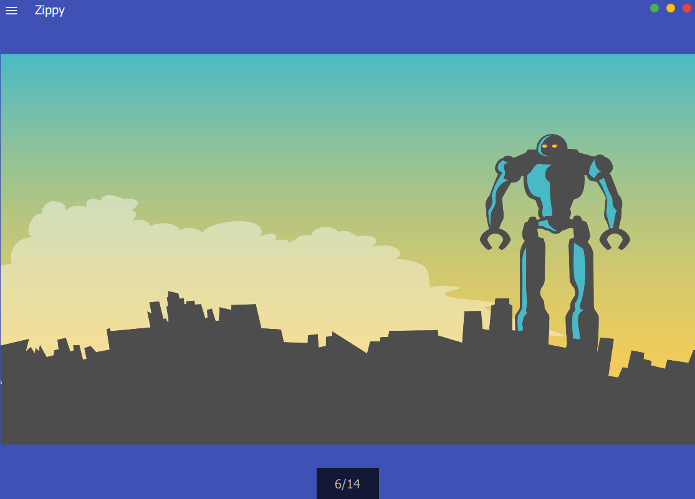
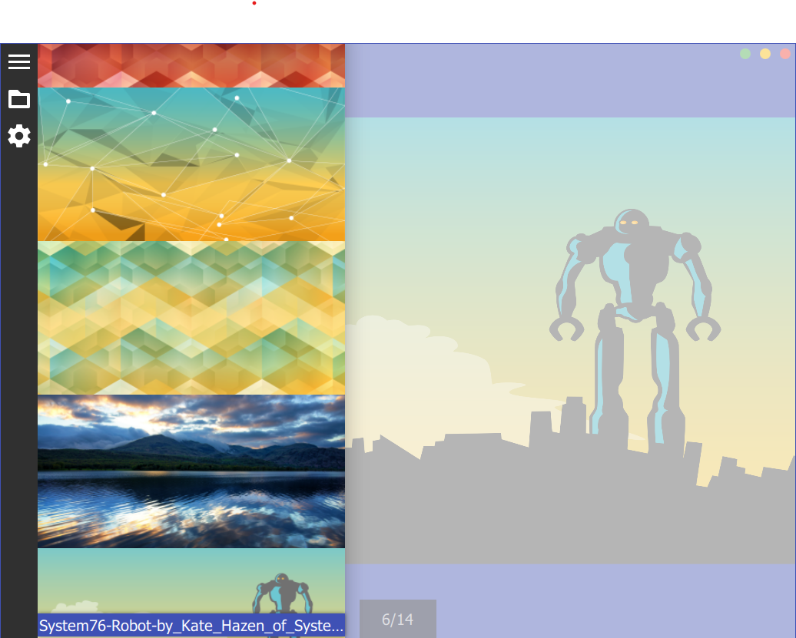

# Zippy
Browser for archived collections of images

### Dependencies
- [Quazip](http://quazip.sourceforge.net/ "Quazip") - handles zipping and unzipping
- [Zlib](http://zlib.net/ "Zlib") - Quazip dependency

### TODO
- Improve code
- Add video support
- Add zip inside zip support
- Improve password support (right now it assumes every file is protected with the same password)
- Improve image loading